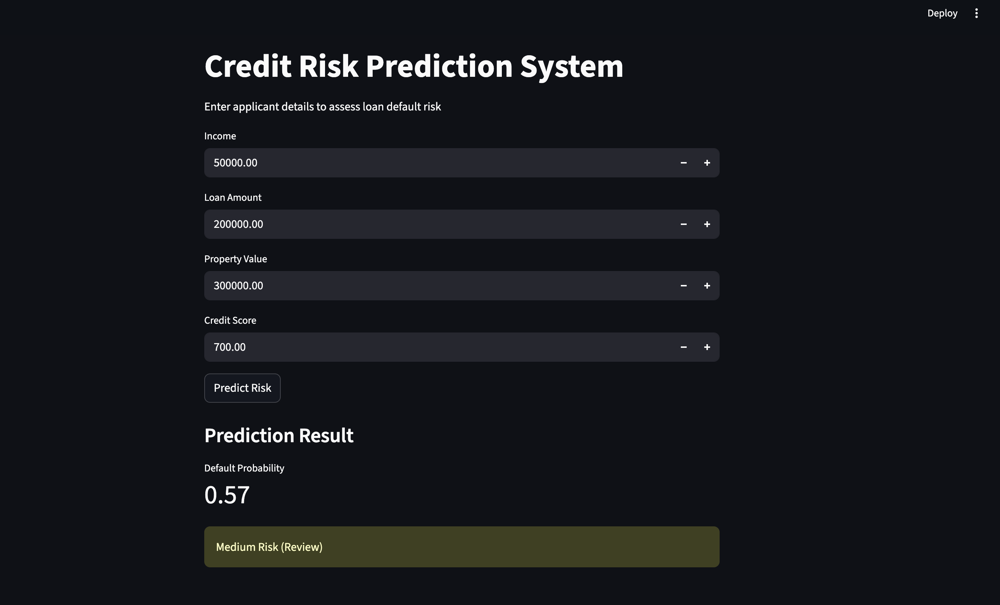
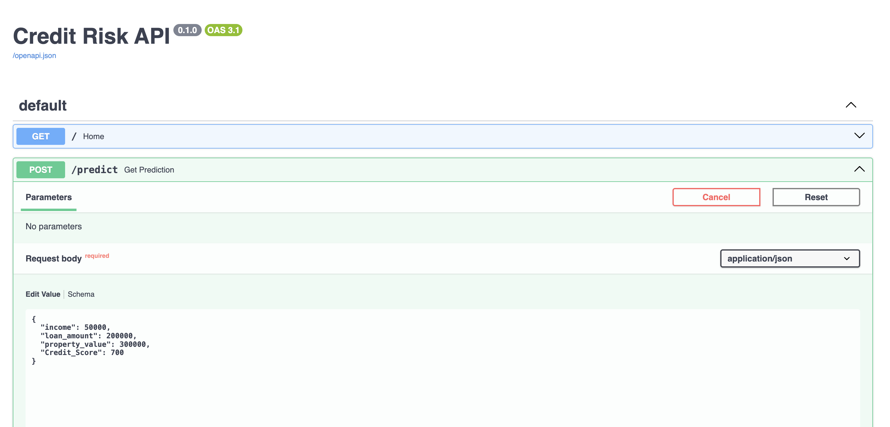
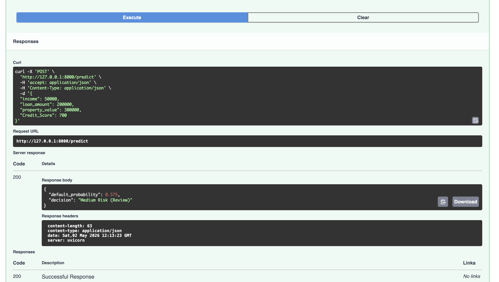
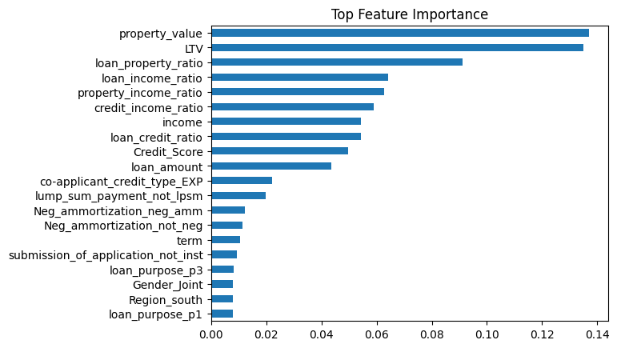

# Credit Risk Prediction System (End-to-End Machine Learning Project)

An end-to-end machine learning system for assessing loan default risk, combining data preprocessing, predictive modeling, explainability, and real-time deployment.

---

## Overview

Financial institutions must evaluate borrower risk before approving loans. Poor decisions can result in significant financial losses due to defaults or missed opportunities.

This project simulates a real-world credit risk assessment pipeline that:

* Predicts the probability of loan default
* Classifies applicants into actionable risk categories
* Provides interpretable insights into model decisions
* Exposes predictions via API and interactive dashboard

---

## Demo

### User Interface


### API Endpoint



### Model Insights


---

## Key Features

* Data preprocessing pipeline (missing values, outlier handling, feature engineering)
* Feature engineering using domain-specific financial ratios
* Machine learning model using Random Forest with class balancing
* Explainable AI using SHAP for interpretability
* Cost-sensitive evaluation aligned with real-world financial impact
* REST API built with FastAPI for real-time inference
* Interactive dashboard built with Streamlit

---

## Architecture

User Input → Streamlit UI → FastAPI → ML Model → Prediction → Risk Decision

---

## Project Structure

```bash
credit-risk/
├── app/
│   ├── api.py            # FastAPI backend
│   └── app.py            # Streamlit UI
│
├── src/
│   ├── preprocess.py     # Data cleaning & feature engineering
│   ├── train.py          # Model training pipeline
│   ├── predict.py        # Inference pipeline
│
├── models/               # Saved model, scaler, and feature columns
├── notebooks/            # EDA and experimentation
├── tests/                # Unit tests
├── requirements.txt
└── README.md
```

---

## Tech Stack

* Language: Python
* Libraries: Pandas, NumPy, Scikit-learn, SHAP
* Backend: FastAPI
* Frontend: Streamlit
* Model persistence: Joblib

---

## Model Performance

### Baseline Model (Threshold = 0.5)

Confusion Matrix:

```
[[22139   267]
 [ 3137  4191]]
```

Classification Report:

* Accuracy: **0.89**
* Precision (Default Class): **0.94**
* Recall (Default Class): **0.57**
* F1-score (Default Class): **0.71**

ROC-AUC Score: **0.8701**

---

## Business-Oriented Evaluation

To reflect real-world impact, the model is evaluated using cost-sensitive metrics:

* False Positive (rejecting good customer): ₹10,000
* False Negative (approving defaulter): ₹100,000

Results:

* False Positives: **267**
* False Negatives: **3137**
* Estimated Business Loss: **₹316,370,000**

---

## Threshold Optimization

To reduce financial risk, the decision threshold was adjusted.

### Tuned Model (Threshold ≈ 0.6–0.7)

Confusion Matrix:

```
[[22319    87]
 [ 3412  3916]]
```

Key changes:

* False Positives reduced from **267 → 87**
* Precision improved to **0.98** (for default prediction)
* Slight drop in recall (trade-off accepted for lower financial risk)

Accuracy: **0.88**

---

## Key Insights

* Loan-to-income ratio is a strong indicator of default risk
* Lower credit scores significantly increase default probability
* Financial ratios are more predictive than raw features
* Reducing false positives significantly improves business outcomes

---

## Example Prediction

Input:

```json
{
  "income": 50000,
  "loan_amount": 200000,
  "property_value": 300000,
  "Credit_Score": 700
}
```

Output:

```json
{
  "default_probability": 0.78,
  "decision": "High Risk (Reject)"
}
```

---

## How to Run

```bash
source venv/bin/activate
python -m uvicorn app.api:app --reload
streamlit run app/app.py
```

---

## Setup (Full)

```bash
git clone https://github.com/kira04v/credit-risk-prediction.git
cd credit-risk

python3 -m venv venv
source venv/bin/activate

pip install -r requirements.txt
python src/train.py
```

---

## Testing

```bash
pytest tests/
```

---

## Future Improvements

* Deploy on cloud (Render / AWS / GCP)
* Integrate SHAP explanations into UI
* Improve model using XGBoost or LightGBM
* Add user authentication and logging

---

## Key Learnings

* Building modular and reusable ML pipelines
* Handling feature consistency between training and inference
* Deploying ML systems with APIs and interactive dashboards
* Aligning ML performance with business decision-making

---

## Contact

Ayush Srivastava
GitHub: https://github.com/kira04v

---

If you found this project useful, consider starring the repository.
